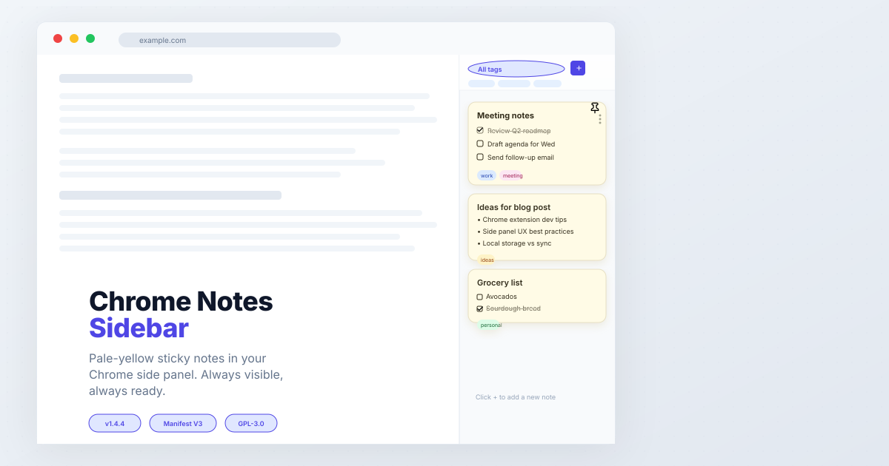
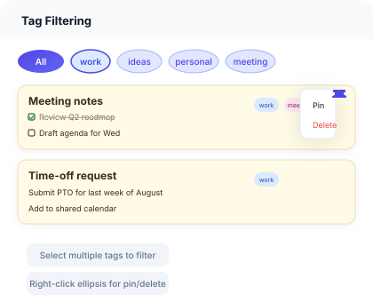
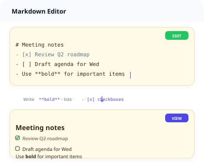
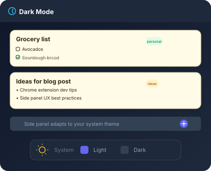

<!-- markdownlint-disable MD033 MD041 -->
<p align="center">
  <picture>
    <source media="(prefers-color-scheme: dark)" srcset="svg/hero.svg">
    
  </picture>
</p>

<div align="center">

**Persistent sticky notes that live in Chrome's side panel.**
**Always visible, always ready.**

[](manifest.json)
[](LICENSE)
[](manifest.json)
[](https://chrome.google.com/webstore)

</div>

---

## ✨ Features

<p align="center">
  
  
  
</p>

### Classic sticky notes — in your browser

Chrome Notes Sidebar places a familiar **pale-yellow sticky note** dashboard in Chrome's native side panel. It stays open as you browse, giving you a dedicated space for thoughts, tasks, and ideas alongside your active tabs.

- **Always visible** — opens in Chrome's side panel, persists across tabs
- **Zero tracking** — all data stays on your device
- **Lightweight** — no remote databases, no background processes

### Core features

| Feature | Description |
|---|---|
| **📝 Markdown editing** | Write with `**bold**`, `- lists`, `- [x] checkboxes`. Toggle between edit and view mode. |
| **🏷️ Tag filtering** | Organize notes with tags. Select multiple tags to narrow down. |
| **📍 Note pinning** | Pin important notes to the top of your list. Visual pushpin indicator. |
| **🎯 Action menu** | Hover a note card and click the ellipsis (⋮) for pin/unpin and delete actions. |
| **✅ Live checklists** | Check and uncheck tasks in view mode without entering edit mode. |
| **🗑️ Safe deletion** | Confirmation overlay prevents accidental removal. |
| **🌗 Dark mode** | Automatically adapts to your system color scheme. |
| **⌨️ Smart editing** | Auto-inserts `- ` and `- [ ] ` prefixes on Enter. Double-click to edit. `Cmd/Ctrl+Enter` to save. |
| **💾 Auto-save** | Changes are saved instantly to local storage. Fallback to `localStorage` if `chrome.storage` is unavailable. |

---

## 📦 Installation

### From source (developer mode)

1. **Clone the repository**
   ```bash
   git clone https://github.com/russelldickenson/chrome-notes-on-the-side.git
   cd chrome-notes-on-the-side
   ```

2. **Load the extension in Chrome**
   - Open `chrome://extensions`
   - Enable **Developer mode** (toggle in the top right)
   - Click **Load unpacked**
   - Select the `chrome-notes-on-the-side` folder

3. **Open the side panel**
   - Click the extension icon in the Chrome toolbar
   - Or use `Cmd/Ctrl+Shift+I` and navigate to the **Notes** tab in the side panel

### From the Chrome Web Store

<!-- _Coming soon — the extension has been submitted for review._ -->

---

## 🚀 Usage

### Quick start

1. Click the extension icon → the side panel opens on the right
2. Click the **+** button to create a new note
3. Start typing — use markdown for formatting
4. Click outside the note or press `Esc` to see the rendered preview
5. Hover over any note card and click the **⋮** (ellipsis) for pin/delete options

### Markdown reference

| Format | Example | Result |
|---|---|---|
| Bold | `**Important**` | **Important** |
| Heading | `# Title` | ## Title |
| Bullet list | `- item` | • item |
| Checklist | `- [ ] task` | ☐ task |
| Checked item | `- [x] done` | ☑ done |
| Link | `[target](url)` | [target](url) |

### Keyboard shortcuts

| Shortcut | Action |
|---|---|
| `Double-click` on a note | Enter edit mode |
| `Cmd/Ctrl+Enter` | Save and switch to view mode |
| `Esc` | Close editor / return to list |

---

## 🔐 Permissions

| Permission | Purpose |
|---|---|
| `sidePanel` | Display the sticky notes dashboard in Chrome's persistent side panel |
| `storage` | Securely store, retrieve, and synchronize notes locally |

**No data collection.** No analytics. No remote servers. Everything stays on your device.

---

## 📋 Changelog

A full changelog is maintained in [CHROMEWEBSTORE.md](CHROMEWEBSTORE.md). Notable releases:

- **1.5.0** - Added support for Markdown links - `[target](url)`
- **v1.4.4** — Latest stable release
- **v1.4.0** — Smart Markdown editor (auto-indent, prefix insertion)
- **v1.3.0** — Data loss prevention safeguards
- **v1.2.0** — Compact header design, multi-tag filtering
- **v1.1.0** — Action menu, note pinning, localStorage fallback
- **v1.0.0** — Initial release

---

## 📄 License

[GNU General Public License v3.0](LICENSE) — Free software. See [LICENSE](LICENSE) for details.

---

<div align="center">
  <sub>Built with ❤️ for Chrome · No data collected · No tracking · No servers</sub>
</div>
